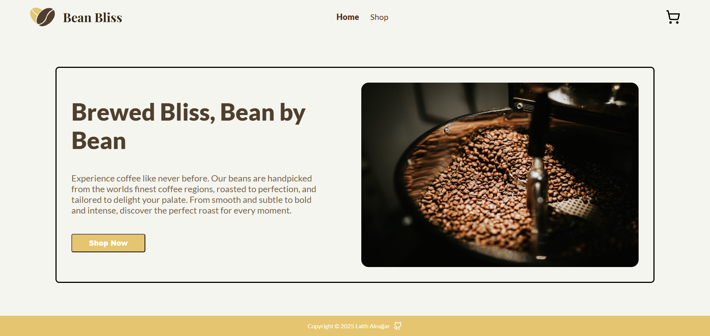
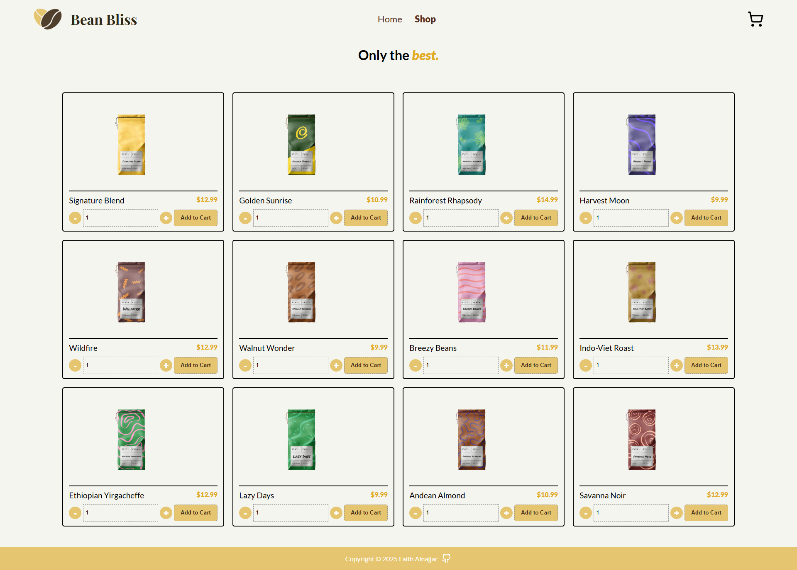

# Bean Bliss

Bean Bliss is a modern coffee-themed e-commerce app. It features a responsive design, dynamic product listings, a functional cart, and smooth navigation. This project highlights front-end development skills and a focus on clean, user-friendly design.

---

## **Features**

- **Responsive Design**: Optimized for all devices.
- **Add to Cart**: Manage your cart with ease.
- **Routing**: Seamless navigation using React Router.

---

## **Tech Stack**

- **Frontend**: React (with Vite)
- **Routing**: React Router
- **Testing**: Jest and React Testing Library
- **Deployment**: Vercel

---

## **Screenshots**

### Homepage



### Product Page



---

## **Demo**

Experience the live version of Bean Bliss here: [Live Demo](https://bean-bliss.vercel.app/)

---

## **Setup Instructions**

1. Clone the repository:
   ```bash
   git clone https://github.com/yourusername/bean-bliss.git
   ```
2. Navigate into the project directory:
   ```bash
   cd bean-bliss
   ```
3. Install dependencies:
   ```bash
   npm install
   ```
4. Start the development server:
   ```bash
   npm run dev
   ```
5. Open the app in your browser at `http://localhost:5173`.
